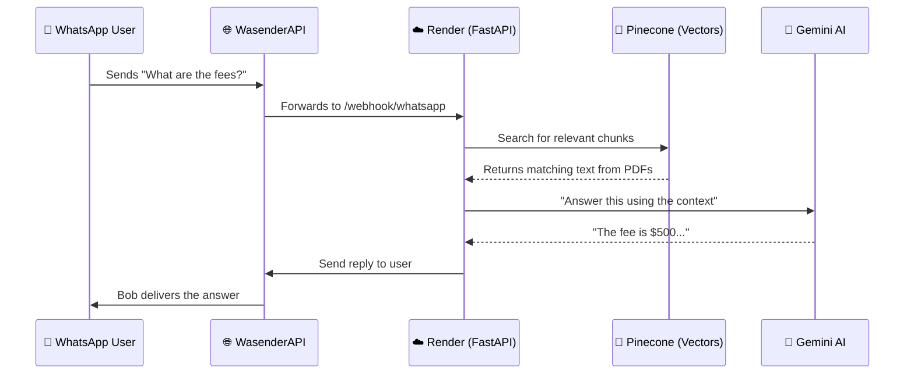

# 🤖 Bob: Your AI-Powered WhatsApp Assistant

**Bob** is a smart chatbot that reads your university documents (PDFs/Text files) and answers questions about them via WhatsApp. It uses a **RAG (Retrieval-Augmented Generation)** pipeline to find relevant information from your documents and generate accurate, friendly responses.

> **Live App**: `https://whatsappragchatbot.onrender.com`
> **Admin UI**: `https://whatsappragchatbot.onrender.com/admin`
> **Webhook**: `https://whatsappragchatbot.onrender.com/webhook/whatsapp`

---

## 🗺️ How It Works (Big Picture)



---

## 👥 System Components

| Component | Role | Technology |
|:---|:---|:---|
| **WhatsApp User** | The end user asking questions | WhatsApp |
| **WasenderAPI** | WhatsApp API bridge | WasenderAPI |
| **FastAPI** | Core backend server | Python / Render |
| **Pinecone** | Vector database for semantic search | `txstate-rag-v2` index |
| **Supabase** | SQL database for chat logs & documents | PostgreSQL |
| **FastEmbed** | Generates text embeddings (ONNX, no PyTorch) | `BAAI/bge-small-en-v1.5` |
| **Gemini** | LLM for generating responses | Google Gemini API |

---

## 🚀 Running Locally

### Step 1: Install Dependencies
```powershell
pip install -r requirements.txt
```

### Step 2: Set Up Environment Variables
Create a `.env` file in the project root:
```env
SUPABASE_URL=your_supabase_url
SUPABASE_KEY=your_supabase_service_role_key
OPENAI_API_KEY=your_openai_api_key
PINECONE_API_KEY=your_pinecone_api_key
WASENDER_API_KEY=your_wasender_api_key
HF_API_KEY=your_huggingface_api_key
GEMINI_API_KEY=your_gemini_api_key
```

### Step 3: Start the Server
```powershell
uvicorn main:app --reload
```
Server runs at `http://localhost:8000`

### Step 4: Expose Locally via Tunnel
```powershell
npx localtunnel --port 8000
```
Use the generated URL as your WasenderAPI webhook.

---

## 🧠 RAG Pipeline (Under the Hood)

### Phase 1: Document Ingestion
When you upload a PDF via the Admin UI:
1. **Text Extraction** — `pypdf` reads the PDF
2. **Chunking** — Text is split into overlapping chunks via `langchain-text-splitters`
3. **Embedding** — Each chunk is vectorized using **FastEmbed** (`BAAI/bge-small-en-v1.5`, 384 dims, ONNX)
4. **Pinecone Storage** — Vectors stored in `txstate-rag-v2` index
5. **Supabase Tracking** — File name and status saved in the `documents` table

### Phase 2: Query & Retrieval
When a WhatsApp message arrives:
1. The user's question is embedded using the same FastEmbed model
2. Pinecone finds the top-3 most similar text chunks
3. The retrieved text becomes the **context** for the AI

### Phase 3: Response Generation (LLM Fallback Chain)
The `llm_manager.py` tries these in order:
1. **OpenAI** (GPT) — if API key has credits
2. **HuggingFace** — free inference fallback
3. **Google Gemini** — free, reliable fallback

---

## 📱 Connecting to WhatsApp (Production)

1. Log in to **WasenderAPI Dashboard** → Add Instance → Scan QR code.
2. Go to **Instance Settings** → Webhook URL:
   ```
   https://whatsappragchatbot.onrender.com/webhook/whatsapp
   ```
3. Set **Webhook Status** to **Enabled** and save.
4. Send a WhatsApp message to your connected number to test.

> **Note**: WasenderAPI's "Simulate" button requires a Personal Access Token. Skip it — just send a real WhatsApp message to test.

---

## 📊 Database Schema (Supabase)

| Table | Purpose |
|---|---|
| `documents` | Tracks uploaded PDFs and their indexing status |
| `conversations` | Stores unique phone numbers |
| `messages` | Full chat history (user + assistant messages) |

---

## 🩺 API Endpoints

| Endpoint | Method | Purpose |
|---|---|---|
| `/` | GET | Health check message |
| `/health` | GET | Server + Supabase status |
| `/admin` | GET | Admin UI dashboard |
| `/admin/debug` | GET | Check all env variables |
| `/admin/upload` | POST | Upload & index a document |
| `/admin/documents` | GET | List indexed documents |
| `/admin/documents/{id}` | DELETE | Delete a document + its vectors |
| `/admin/logs` | GET | Recent chat logs |
| `/webhook/whatsapp` | POST | WasenderAPI webhook receiver |

---

## 🛠️ Key Files

| File | Purpose |
|---|---|
| `main.py` | FastAPI server, all routes |
| `services/doc_processor.py` | PDF reading, chunking, Pinecone upload |
| `services/rag_service.py` | Semantic search via Pinecone |
| `services/embedding_service.py` | FastEmbed ONNX embeddings (384 dims) |
| `services/llm_manager.py` | Multi-LLM fallback chain |
| `static/index.html` | Admin UI |
| `requirements.txt` | Python dependencies |
| `.python-version` | Pins Python 3.11.9 for Render |

---

## ⚠️ Known Limitations (Free Tier)

- **Cold starts**: Render free tier spins down after 15 min of inactivity. First message after idle may take 50+ seconds.
- **Ephemeral disk**: Uploaded PDF files are lost on redeploy. Re-upload via Admin UI after each deployment (vectors remain in Pinecone).
- **Memory**: 512MB limit. FastEmbed uses ~150MB — within limits.