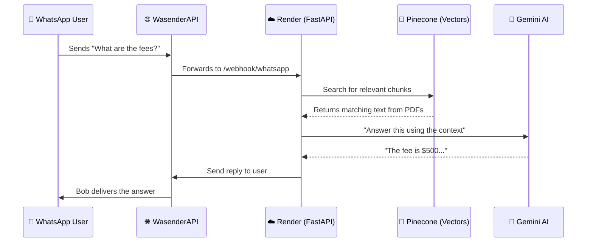

# 🤖 Bob: Your AI-Powered WhatsApp Assistant

**Bob** is a smart chatbot that reads your university documents (PDFs/Text files) and answers questions about them via WhatsApp. It uses a **RAG (Retrieval-Augmented Generation)** pipeline to find relevant information from your documents and generate accurate, friendly responses.

> **Live App**: `https://whatsappragchatbot.onrender.com`
> **Admin UI**: `https://whatsappragchatbot.onrender.com/admin`
> **Webhook**: `https://whatsappragchatbot.onrender.com/webhook/whatsapp`

---

## 🗺️ How It Works (Big Picture)



---

## 👥 System Components

| Component | Role | Technology |
|:---|:---|:---|
| **WhatsApp User** | The end user asking questions | WhatsApp |
| **WasenderAPI** | WhatsApp API bridge — forwards messages to our webhook | WasenderAPI |
| **FastAPI** | Core backend server handling all routes and business logic | Python / Render |
| **Pinecone** | Vector database for semantic similarity search | `txstate-rag-v2` index |
| **Supabase** | SQL database for persisting chat logs & document metadata | PostgreSQL |
| **FastEmbed** | Local ONNX-based text embeddings — no GPU, no PyTorch needed | `BAAI/bge-small-en-v1.5` (384 dims) |
| **Gemini** | Primary LLM for generating responses (free, reliable fallback) | Google Gemini API |

---

## 🚀 Running Locally

### Step 1: Install Dependencies
```powershell
pip install -r requirements.txt
```

### Step 2: Set Up Environment Variables
Create a `.env` file in the project root:
```env
# Supabase — PostgreSQL for chat history & document tracking
SUPABASE_URL=your_supabase_url
SUPABASE_KEY=your_supabase_service_role_key

# OpenAI — Primary LLM (GPT-4o-mini). Leave blank to skip and use fallbacks.
OPENAI_API_KEY=your_openai_api_key

# Pinecone — Vector store for RAG semantic search
PINECONE_API_KEY=your_pinecone_api_key

# WasenderAPI — WhatsApp messaging bridge
WASENDER_API_KEY=your_wasender_api_key

# HuggingFace — Free inference API fallback (second in chain)
HF_API_KEY=your_huggingface_api_key

# Google Gemini — Final LLM fallback (most reliable on free tier)
GEMINI_API_KEY=your_gemini_api_key
```

### Step 3: Start the Server
```powershell
uvicorn main:app --reload
```
Server runs at `http://localhost:8000`

### Step 4: Expose Locally via Tunnel
```powershell
npx localtunnel --port 8000
```
Use the generated URL as your WasenderAPI webhook.

---

## 🧠 RAG Pipeline (Under the Hood)

### Phase 1: Document Ingestion
When you upload a PDF via the Admin UI:
1. **Text Extraction** — `pypdf` reads the raw PDF pages
2. **Chunking** — Text is split into overlapping chunks using `langchain-text-splitters` (preserves context at boundaries)
3. **Embedding** — Each chunk is vectorized locally using **FastEmbed** (`BAAI/bge-small-en-v1.5`, 384 dims, ONNX runtime — no PyTorch, no GPU required)
4. **Pinecone Storage** — Vectors uploaded and stored in the `txstate-rag-v2` index (persists across redeploys)
5. **Supabase Tracking** — File name, upload timestamp, and status saved in the `documents` table

### Phase 2: Query & Retrieval
When a WhatsApp message arrives:
1. The user's question is embedded using the same FastEmbed model (ensures vector space consistency)
2. Pinecone performs a cosine similarity search and returns the top-3 most relevant text chunks
3. The retrieved chunks become the **context** injected into the LLM prompt

### Phase 3: Response Generation (LLM Fallback Chain)
`services/llm_manager.py` tries these providers in order — if one fails, it moves to the next:
1. **OpenAI** (`gpt-4o-mini`) — highest quality; requires active API credits
2. **HuggingFace Inference API** — free fallback; tries multiple models: `Meta-Llama-3.1-8B`, `Meta-Llama-3.1-70B`, `Mistral-7B`, `distilgpt2`
3. **Google Gemini** (`gemini-1.5-flash` or best available) — final failsafe; auto-discovers available models via SDK

---

## 📱 Connecting to WhatsApp (Production)

1. Log in to **WasenderAPI Dashboard** → Add Instance → Scan QR code.
2. Go to **Instance Settings** → Webhook URL:
   ```
   https://whatsappragchatbot.onrender.com/webhook/whatsapp
   ```
3. Set **Webhook Status** to **Enabled** and save.
4. Send a WhatsApp message to your connected number to test.

> **Note**: WasenderAPI's "Simulate" button requires a Personal Access Token. Skip it — just send a real WhatsApp message to test.

---

## 📊 Database Schema (Supabase)

| Table | Purpose |
|---|---|
| `documents` | Tracks uploaded PDFs, their file name, and Pinecone indexing status |
| `conversations` | Stores unique phone numbers (one row per WhatsApp contact) |
| `messages` | Full chat history per conversation — both user queries and assistant replies |

---

## 🩺 API Endpoints

| Endpoint | Method | Purpose |
|---|---|---|
| `/` | GET | Health check — returns a simple alive message |
| `/health` | GET | Detailed status — checks Supabase connectivity |
| `/admin` | GET | Admin UI dashboard (upload docs, view logs) |
| `/admin/debug` | GET | Diagnostic view of all loaded environment variables |
| `/admin/upload` | POST | Upload a PDF, chunk it, embed it, and push to Pinecone |
| `/admin/documents` | GET | List all documents tracked in Supabase |
| `/admin/documents/{id}` | DELETE | Remove a document record from Supabase and its vectors from Pinecone |
| `/admin/logs` | GET | View recent chat message history |
| `/webhook/whatsapp` | POST | WasenderAPI webhook — receives and processes incoming WhatsApp messages |

---

## 🛠️ Key Files

| File | Purpose |
|---|---|
| `main.py` | FastAPI server entry point — defines all API routes and startup logic |
| `services/doc_processor.py` | Handles PDF reading, text chunking, and Pinecone vector upload |
| `services/rag_service.py` | Performs semantic similarity search against the Pinecone index |
| `services/embedding_service.py` | Wraps FastEmbed ONNX model (`BAAI/bge-small-en-v1.5`, 384 dims) |
| `services/llm_manager.py` | Multi-LLM fallback chain: OpenAI → HuggingFace → Gemini |
| `static/index.html` | Admin UI — browser-based dashboard for document management and log viewing |
| `requirements.txt` | Python package dependencies (no PyTorch — keeps image size small) |
| `.python-version` | Pins Python 3.11.9 for Render deployment (required by fastembed Rust bindings) |

---

## ⚠️ Known Limitations (Free Tier)

- **Cold starts**: Render free tier spins down after 15 min of inactivity. First message after idle may take 50+ seconds to respond.
- **Ephemeral disk**: Uploaded PDF files are deleted on every redeploy. Re-upload via the Admin UI after each deployment — Pinecone vectors are unaffected and persist.
- **Memory**: 512MB RAM limit on Render free tier. FastEmbed uses ~150MB at runtime, leaving comfortable headroom.
- **LLM credits**: OpenAI (`gpt-4o-mini`) requires a funded account. If credits run out, the system automatically falls back to HuggingFace and then Gemini at no cost.

---

## 📚 Real-World Q&A Examples

Here are examples of how Bob uses your uploaded documents to answer questions:

| User Question | Bob's Answer (The "Magic") | Source Document Used |
|:---|:---|:---|
| *"What is the admission fee for 2024?"* | *"Based on the Fees Policy, the admission fee for the 2024 academic year is $500..."* | `fees_policy.pdf` |
| *"Do you have an MBA program?"* | *"Yes! According to the Course Details, we offer a 2-year MBA program with specializations in..."* | `course_details.pdf` |
| *"How do I apply?"* | *"You can apply online via our portal. The Admission Process document states you need your high school transcripts..."* | `admission_process.pdf` |
| *"What is the attendance policy?"* | *"According to University Policies, a minimum of 75% attendance is required to sit for exams..."* | `university_policies.pdf` |
| *"Do you provide hostel facilities?"* | *"Yes, the FAQ document mentions that we have separate hostels for boys and girls with 24/7 security..."* | `faq.pdf` |
| *"When is the annual fest?"* | *"The University Brochure mentions that our annual cultural fest, 'Euphoria', usually happens in March..."* | `brochure.pdf` |
| *"What are the library timings?"* | *"The Student Handbook states the library is open from 8:00 AM to 10:00 PM on weekdays and until 6:00 PM on Saturdays."* | `handbook.pdf` |
| *"What is the CSE placement record?"* | *"According to the 2023 Placement Report, the CSE department had a 95% placement rate with a median package of $12 LPA."* | `placement_report.pdf` |
| *"What is the deadline for the final semester project?"* | *"The Academic Calendar for 2024 indicates that final semester project submissions are due by May 15th."* | `academic_calendar.pdf` |
| *"Can I get a refund if I cancel?"* | *"I'm sorry, I don't have that information. Please contact the Admissions Office at 9704574919 or test@gmail.com for further assistance."* | *(Not in uploaded PDFs)* |

---

## 🚀 Advanced Scenarios

- **Contextual Follow-ups**: Bob remembers the flow of a conversation. If a user asks *"What about the hostel?"* right after asking about admissions, Bob understands the context and doesn't require them to repeat themselves.

- **Multi-Document Synthesis**: If relevant information is spread across multiple uploaded PDFs (e.g., a fee structure in one file and a scholarship deadline in another), Bob combines them into a single, coherent answer rather than answering from just one source.

- **Graceful Fallback for Unknown Questions**: If a question is outside the scope of all uploaded documents, Bob doesn't hallucinate. Instead, it clearly states it doesn't have that information and directs the user to the appropriate contact (Admissions Office number/email defined in the system prompt).

- **LLM Resilience**: If OpenAI is unavailable or out of credits, the system silently retries with HuggingFace models (`Meta-Llama-3.1-8B`, `Mistral-7B`, etc.) and finally falls back to **Google Gemini** — all without any user-facing error or disruption.