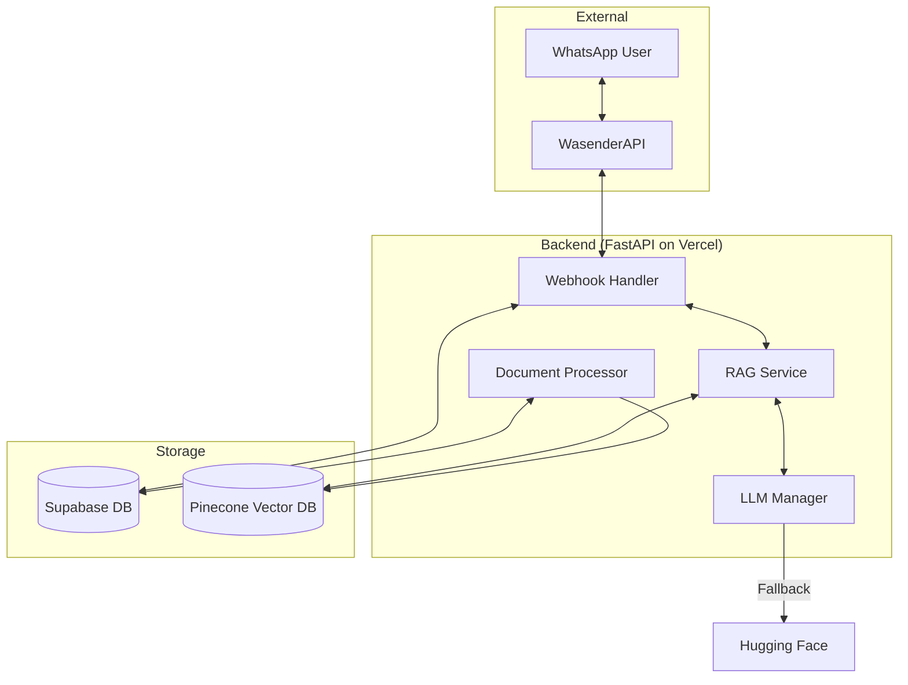
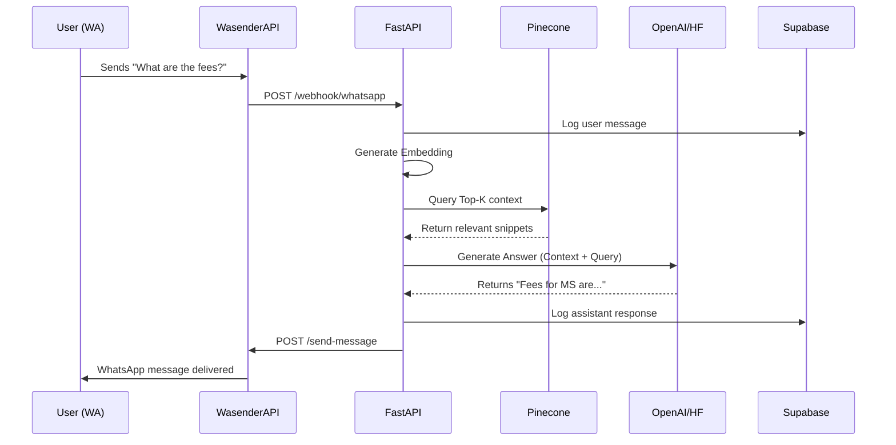

# 🏗️ Technical Design Document: AI WhatsApp RAG Chatbot

## 1. System Overview
This system is an AI-powered chatbot that interacts with users via WhatsApp using **WasenderAPI**, retrieves context from a **Pinecone** vector database using RAG (Retrieval-Augmented Generation), and generates responses via **OpenAI** (with a **Hugging Face** fallback). The backend is built with **FastAPI** and hosted on **Vercel**.

---

## 2. Architecture Diagram



---

## 3. Database Schemas

### 3.1. Supabase (Relational)
Used for tracking conversations, logs, and document metadata.

#### Table: `conversations`
| Column | Type | Description |
| :--- | :--- | :--- |
| `id` | UUID (PK) | Unique conversation ID. |
| `phone_number` | String | User's WhatsApp number. |
| `last_message_at` | Timestamp | For session management. |
| `created_at` | Timestamp | Record creation. |

#### Table: `messages`
| Column | Type | Description |
| :--- | :--- | :--- |
| `id` | UUID (PK) | Unique message ID. |
| `conversation_id`| UUID (FK) | Reference to `conversations`. |
| `role` | Enum | 'user' or 'assistant'. |
| `content` | Text | The actual message text. |
| `created_at` | Timestamp | Message time. |

#### Table: `documents`
| Column | Type | Description |
| :--- | :--- | :--- |
| `id` | UUID (PK) | Unique document ID. |
| `filename` | String | Original filename. |
| `status` | Enum | 'processing', 'indexed', 'error'. |
| `file_url` | String | Link to file in Supabase Storage. |

### 3.2. Pinecone (Vector)
Used for semantic search.

*   **Index Name**: `txstate-rag`
*   **Dimension**: 1536 (matches OpenAI `text-embedding-3-small`)
*   **Metric**: Cosine Similarity
*   **Metadata Schema**:
    *   `text`: The raw text chunk.
    *   `source`: Filename or Document ID.
    *   `chunk_index`: Sequence number for context ordering.

---

## 4. Component Breakdown

### 4.1. `Webhook Handler` (FastAPI)
- Listens for `POST /webhook/whatsapp`.
- Validates the WasenderAPI payload.
- Upserts the user into `conversations`.
- Triggers the RAG process.

### 4.2. `Document Processor`
- Splits PDF/Text into chunks using `RecursiveCharacterTextSplitter`.
- Generates embeddings via OpenAI.
- Upserts vectors into Pinecone.
- Updates status in Supabase.

### 4.3. `RAG Service`
- Converts user query into an embedding.
- Queries Pinecone for top-3 relevant chunks.
- Combines chunks into a context string.

### 4.4. `LLM Manager`
- Construct the system prompt with context.
- Calls **OpenAI** Chat Completion.
- **Fallback Logic**: If OpenAI returns a 5xx or rate limit error, immediately call **Hugging Face Inference API** with a similar prompt.

---

## 5. Sequence Diagram: User Query Flow



---

## 6. Integration Specifications

### 6.1. WasenderAPI Request Payload
```json
{
  "sender": "1234567890",
  "message": "Hello, how do I apply?",
  "timestamp": "2024-04-28T..."
}
```

### 6.2. System Prompt Template
```text
You are Bob, the Texas State University Admission Assistant.
Use the following pieces of retrieved context to answer the user's question.
If you don't know the answer, say you don't know. 
Context: {context}
Question: {question}
Answer:
```

---

## 7. Infrastructure & Deployment
- **Hosting**: Vercel (Serverless Functions).
- **Frontend**: Simple HTML/CSS/JS Admin Panel (Bootstrap or Vanilla CSS) for document management.
- **Environment Variables**:
    - `OPENAI_API_KEY`
    - `PINECONE_API_KEY`
    - `SUPABASE_URL` / `SUPABASE_KEY`
    - `WASENDER_API_KEY`
    - `HF_API_KEY`
