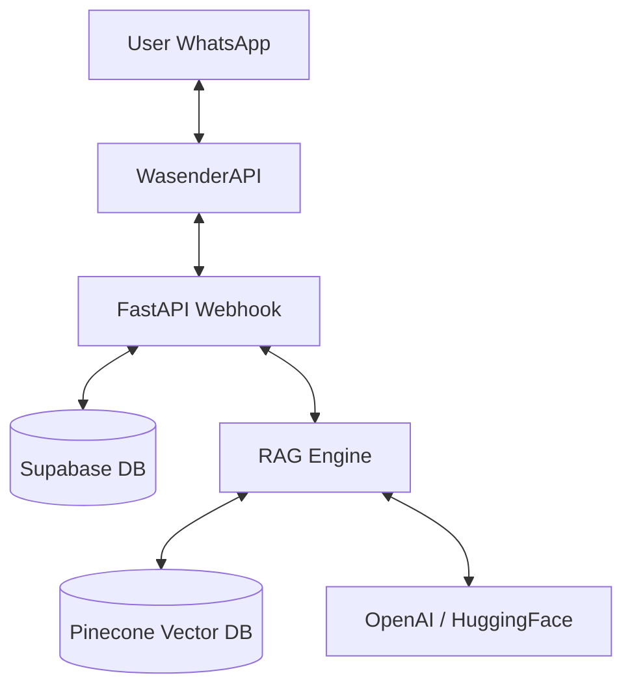

# 📄 Product Requirements Document (PRD)

## 🧩 Project Title

**AI-Powered WhatsApp Chatbot Using RAG**

---

## 🎯 Objective

Build a simple, lightweight WhatsApp chatbot that answers user queries by retrieving relevant information from uploaded documents (policies, FAQs, brochures) and generating accurate responses using AI.

The goal is to **automate repetitive customer support queries** for Texas State University, San Marcos, specifically for bachelor's and master's programs.

---

## 👥 Target Users

* **Prospective students / customers**: Asking about admissions, fees, and courses.
* **Existing customers**: Seeking support or policy information.
* **Admin**: Staff managing the knowledge base and monitoring logs.

---

## 💡 Problem Statement

Manual handling of repetitive queries (admissions, fees, course details) leads to response delays and inconsistent information. This chatbot provides instant, consistent, and context-aware replies via WhatsApp.

---

## 🚀 Core Features

### 1. WhatsApp Integration (WasenderAPI)
* Receive real-time messages via webhook.
* Send automated responses back to users.

### 2. Knowledge Base Management (Admin)
* Upload PDFs, Text files, and FAQs.
* View and delete existing documents.
* Automatic re-indexing of content.

### 3. RAG-Powered AI Engine
* Semantic search using **Pinecone** vector database.
* Primary AI: **OpenAI** (GPT-4o/GPT-3.5-turbo).
* Fallback AI: **Hugging Face** models if OpenAI is unavailable.

### 4. Conversation Tracking
* Maintain chat logs in **Supabase**.
* Store sample data for learning/demonstration purposes.

---

## 🧱 System Architecture

---

## 🛠️ Tech Stack

*   **Backend**: FastAPI (Python)
*   **Database**: Supabase (PostgreSQL) for logs and metadata.
*   **Vector DB**: Pinecone for semantic embeddings.
*   **AI Models**: 
    *   **Primary**: OpenAI (`gpt-4o-mini` or `gpt-3.5-turbo`)
    *   **Fallback**: Hugging Face (via Inference API)
*   **Embeddings**: OpenAI `text-embedding-3-small`.
*   **Deployment**: Vercel (using `.env` for secrets).

---

## 🖥️ Admin Panel Features

*   **Dashboard**: Overview of total queries and document count.
*   **Document Manager**: 
    *   Simple upload form for PDFs/Text.
    *   List of indexed files with delete functionality.
*   **Chat Logs**: View recent interactions between users and the bot.

---

## 🔌 API Endpoints

| Method | Endpoint | Description |
| :--- | :--- | :--- |
| `POST` | `/webhook/whatsapp` | Receives messages from WasenderAPI. |
| `POST` | `/admin/upload` | Uploads and indexes new documents. |
| `GET` | `/admin/documents` | Lists all indexed documents. |
| `DELETE` | `/admin/documents/{id}` | Removes a document from the system. |
| `GET` | `/health` | System status check. |

---

## 🔗 WasenderAPI Integration

*   **Webhook**: Configured to point to the FastAPI `/webhook/whatsapp` endpoint.
*   **Payload**: Handles `sender` (phone number) and `body` (message text).
*   **Response**: Sends JSON back to WasenderAPI to trigger the WhatsApp reply.

---

## ⚙️ Document Processing Pipeline

1.  **Ingestion**: Load PDFs/Text files.
2.  **Chunking**: Recursive Character Text Splitting (Chunk size: 1000 chars, Overlap: 200).
3.  **Embedding**: Generate vectors using OpenAI `text-embedding-3-small`.
4.  **Storage**: Upsert vectors into Pinecone with metadata (`filename`, `text`).

---

## 🧠 Prompt Engineering (University Assistant)

**Persona**: You are "Bob", a helpful Admission Assistant for Texas State University, San Marcos.
**Context**: Only answer questions based on the provided document snippets.
**Constraint**: If the answer is not in the context, say: *"I'm sorry, I don't have that information. Please contact the Admissions Office at [Insert Phone/Email] for further assistance."*

---

## ⚠️ Error Handling

*   **OpenAI Failure**: Automatically switch to Hugging Face Inference API for response generation.
*   **Pinecone Empty Results**: Inform the user that no relevant information was found in the university database.
*   **Invalid File**: Reject non-PDF/Text uploads with an error message to the admin.

---

## 🚀 Deployment

*   **Platform**: Vercel.
*   **Environment Variables**: All API keys (OpenAI, Pinecone, Supabase, Wasender) managed via Vercel Settings.
*   **Simplicity**: No CI/CD pipeline; direct deployment from local/repo.

---

## 🧪 Success Metrics (MVP)

*   Response time < 10 seconds.
*   Correct retrieval of university-specific info (Admissions, Fees).
*   Successful fallback to Hugging Face on OpenAI error.

